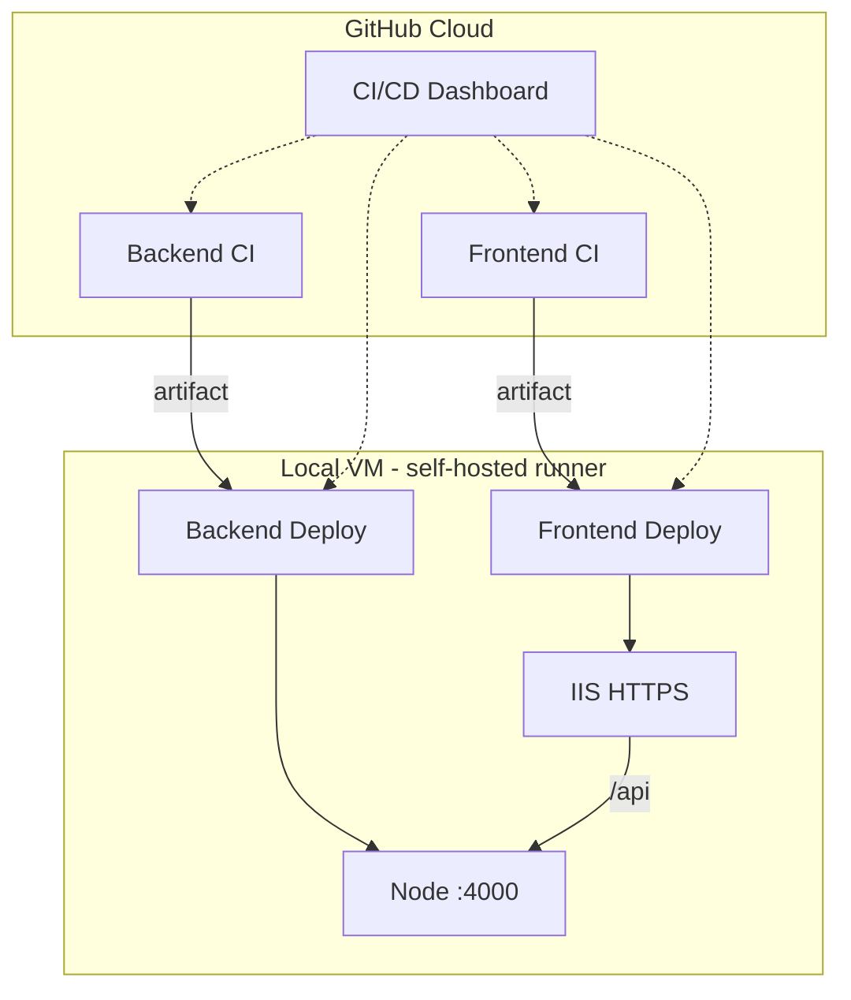

# CI/CD overview

## Pipelines

## Where to see build status (dashboard)

GitHub Actions is the dashboard:

1. **Actions** tab — every run, green/red, logs, duration  
2. **Summary** on each run — markdown status (we write via `GITHUB_STEP_SUMMARY`)  
3. **CI/CD Dashboard** workflow — combined table of all four pipelines  
4. **Deployments** — environment `production` history for frontend/backend deploys  
5. **README badges** — at-a-glance pass/fail on the repo home page  

There is no separate server to install for the dashboard; it lives in GitHub once workflows are pushed.

## Branch flow

- **Pull request** → CI only (no deploy)  
- **Merge to `main`** → CI + auto-deploy (if runner online)  
- **Manual** → Run **Frontend Deploy** or **Backend Deploy** from Actions  

See [deploy/DEPLOY.md](../deploy/DEPLOY.md) for VM setup.
